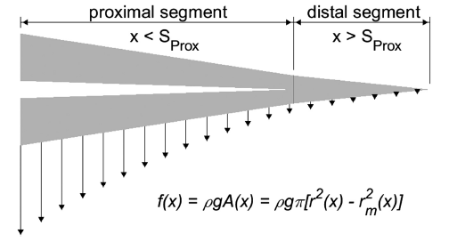

# Rat Whisker Mechanical Properties: download the mechanical properties for over 50 rat whiskers

[Yang et al. (2019)](https://journals.physiology.org/doi/full/10.1152/jn.00869.2016) quantified vibrissal mechanical properties (mass, moments of inertia, etc.) across the rat mystacial pad. All data are available for download.

Please cite the following article when using these data: Yang AE, Belli HM, Hartmann MJZ (2019) Quantification of vibrissal mechanical properties across the rat mystacial pad. J Neurophysiol. 121(5):1879-1895. doi: 10.1152/jn.00869.2016.  
  
[Table 2](https://github.com/SeNSE-lab/RatWhiskerGeometry/blob/master/SupplementalTable_1.csv) provides all data used in the study. We hope to provide a CSV version of the data soon

See also the [complementary article by Belli et al. (2016)](https://journals.physiology.org/doi/full/10.1152/jn.00054.2016), which performed a meta-analysis of the geometric properties of rodent whiskers from seven different studies (over 500 whiskers). [All geometric data are available for download here](https://github.com/SeNSE-lab/RatWhiskerGeometry/blob/master/readme.md).    